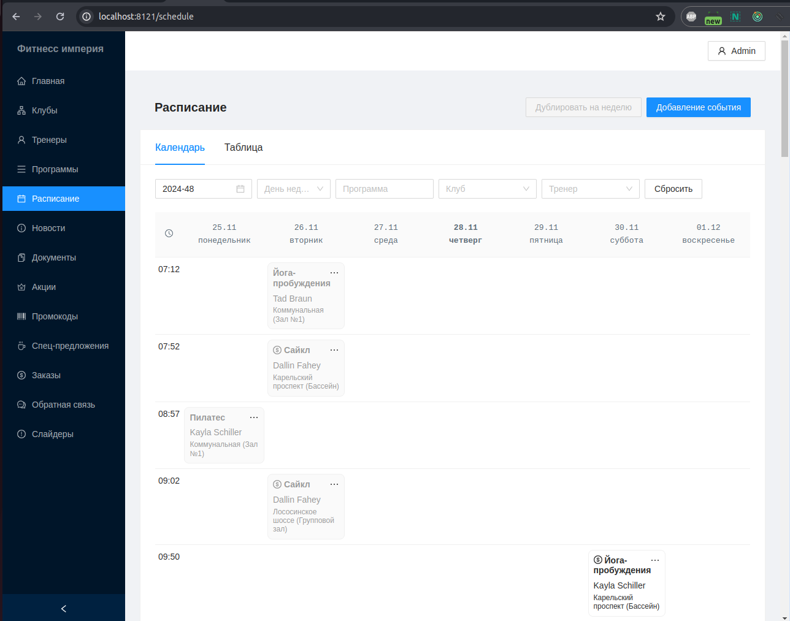

# Fitness-ptz

This part of the Fitness-ptz project is related to the data management system.

## Project Run Requirements

The project runs on machines running the Linux operating system.

The following must be installed:

- docker (checked with 20.10.12)
- docker-compose (checked with 1.23.1)
- make (checked with GNU Make 4.2.1)

In Ubuntu, this can be done with the command:

` sudo apt install docker docker-compose make`

Please note that your local user must be enabled in group **docker**.

## Quick Start for Development

1. git clone to local machine

2. Create an Environment. If you need to change it, create a .env.local file with your adjustments. 
For example, your user and group ID should be specified if they match the default results. You can also change the port of your application if it is already taken. The default port is **8121**.

3. Run the starter installation

   `make install`

4. Run the application

   `make start`

After successful installation, if the settings have not changed, you can open the project at [http://localhost:8121](http://localhost:8121)
